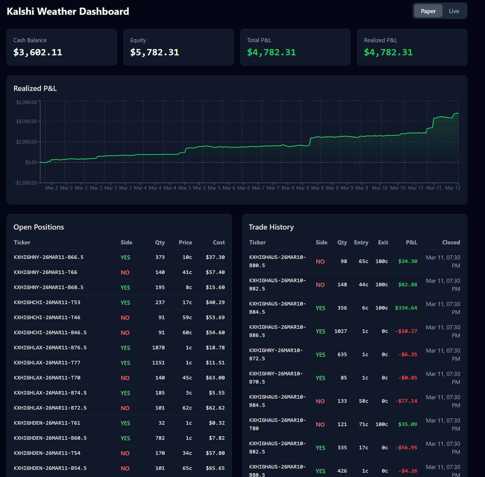

# kalshiweather

**Paper Trading Results: +$4,782 (+478% ROI) in 11 days** — 254 trades, 49.6% win rate, 3.23:1 payoff ratio. See [TRADE_LOG.md](TRADE_LOG.md) for the full verified history.



Automated trading CLI for [Kalshi](https://kalshi.com) temperature prediction markets. Uses GFS 31-member ensemble forecasts with MOS-style bias correction to detect pricing edges, then sizes positions with quarter-Kelly and verifies order book liquidity before execution.

## How It Works

### 1. Ensemble Weather Forecasting

The bot fetches the [GFS ensemble](https://open-meteo.com/en/docs/ensemble-api) (GEFS) from Open-Meteo — 31 independent model runs of the same forecast, each with slightly different initial conditions. For a given city and date, this produces 31 daily high temperature predictions.

Rather than counting members above/below a threshold (which gives crude step-function probabilities with only 31 samples), the bot fits a **Gaussian distribution** to the ensemble:

```
P(temp >= threshold) = 1 - Phi((threshold - mu) / sigma)
```

where `mu` and `sigma` are estimated from the 31 members. A minimum uncertainty floor of **1.5 deg F** prevents overconfident predictions when the ensemble happens to cluster tightly.

### 2. Bias Correction (MOS-Style)

Raw GFS forecasts have systematic errors — running warm in some cities/months, cold in others. The bot corrects for this using **Model Output Statistics (MOS)**-style adjustments trained on historical forecast-vs-actual data.

The training pipeline (`train-bias` command) pulls ~12 months of archived GFS forecasts and compares them to actual NWS observations. For each city and calendar month, it computes:

- **mean_bias**: average (forecast - actual) in deg F. Positive = GFS runs warm.
- **std_error**: standard deviation of errors.
- **samples**: number of data points for that month.

At forecast time, the bias is subtracted from every ensemble member before probability calculation:

```python
corrected_members = [m - mean_bias for m in raw_members]
```

Corrections are stored in `~/.openclaw/kalshi-weather/bias_corrections.json` and require a minimum of 10 samples per city-month to activate. They automatically expire after 45 days, prompting retraining.

**Example corrections** (trained Feb 2026):
| City | Month | Bias | Interpretation |
|------|-------|------|---------------|
| NY | Jan | +1.8 deg F | GFS runs 1.8 deg warm in NYC winters |
| MIA | Jul | -0.6 deg F | GFS slightly cool for Miami summers |
| DEN | Mar | +2.3 deg F | GFS overestimates Denver spring highs |

### 3. Edge Detection

For each temperature bracket market (e.g., `KXHIGHNY-26MAR02-T45`), the bot compares its ensemble-derived probability to the market-implied probability:

```
edge% = (ensemble_prob - market_implied) / market_implied * 100
```

Markets with edge >= **8%** are flagged as opportunities. Both YES and NO sides are evaluated. Markets priced below 5 cents are skipped (illiquid longshots).

### 4. Position Sizing (Quarter-Kelly)

Positions are sized using the [Kelly criterion](https://en.wikipedia.org/wiki/Kelly_criterion) at **25% of the optimal fraction**, capped at 5% of total balance per position:

```
full_kelly = (p * (b + 1) - 1) / b
quarter_kelly = full_kelly * 0.25
```

Quarter-Kelly sacrifices ~50% of theoretical growth rate in exchange for dramatically smoother drawdowns (~3% chance of halving vs 33% at full Kelly).

### 5. Liquidity Verification

Before executing any trade (paper or live), the bot walks the real Kalshi order book to verify:

- Sufficient depth exists at or near the target price
- Actual average fill price accounting for slippage across multiple price levels
- Contracts are trimmed or skipped entirely if the book is too thin

This prevents inflated P&L from phantom fills on illiquid longshots.

## Commands

All commands use `uv run` with inline dependencies (no requirements.txt needed):

```bash
uv run scripts/kalshi.py <command> [--live] [--json]
```

| Command | Description |
|---|---|
| `scan` | Scan all 6 cities for edge opportunities |
| `edge CITY` | Detailed edge analysis for one city (NY, CHI, LAX, MIA, DEN, AUS) |
| `auto` | Scan + auto-buy all edges with Kelly sizing and liquidity checks |
| `auto-settle` | Auto-settle expired paper positions using Kalshi API results |
| `buy TICKER SIDE AMT` | Manual buy (side: yes/no, amount in dollars) |
| `sell TICKER SIDE AMT` | Close a position |
| `markets` | List available temperature markets |
| `market TICKER` | Market detail with full order book |
| `balance` | Portfolio balance |
| `positions` | Current positions with P&L |
| `history` | Trade history |
| `settle TICKER W/L` | Manually settle a paper position (won/lost) |
| `reset` | Reset paper account to $1,000 |
| `train-bias` | Train bias corrections from historical data |

### Flags

| Flag | Description |
|---|---|
| `--live` | Real API trading (default: paper with $1,000 virtual balance) |
| `--json` | JSON output for piping to other tools |

## Architecture

```
Open-Meteo GFS Ensemble API
         |
         v
  31 temperature members
         |
    Bias Correction ──── bias_corrections.json (per-city per-month)
         |
         v
  Gaussian CDF Probabilities
         |
    vs. Kalshi Market Prices ──── Kalshi REST API
         |
         v
   Edge Detection (>= 8%)
         |
   Quarter-Kelly Sizing
         |
   Liquidity Check ──── Real order book depth walk
         |
         v
   Execute / Paper Fill
```

### Project Structure

```
scripts/kalshi.py       # CLI entrypoint — all commands and user-facing output
lib/
  config.py             # City definitions, API URLs, edge/sizing constants
  auth.py               # RSA-PSS (SHA-256) request signing for Kalshi API
  client.py             # KalshiClient — httpx wrapper over Kalshi trade API v2
  weather.py            # GFS ensemble fetch, Gaussian probability model, edge detection, Kelly sizing
  bias.py               # MOS-style bias corrections — training, loading, applying
  positions.py          # JSON-backed paper/live position tracking
STRATEGY.md             # Full strategy & operations guide
```

### Data Storage

Paper trading state lives in `~/.openclaw/kalshi-weather/`:
- `positions.json` — open/closed positions and balance
- `bias_corrections.json` — trained forecast corrections

## Cities

| Code | City | NWS Station | Kalshi Series |
|------|------|-------------|--------------|
| NY | New York | KNYC (Central Park) | KXHIGHNY |
| CHI | Chicago | KORD (O'Hare) | KXHIGHCHI |
| LAX | Los Angeles | KLAX | KXHIGHLAX |
| MIA | Miami | KMIA | KXHIGHMI |
| DEN | Denver | KDEN | KXHIGHDEN |
| AUS | Austin | KAUS | KXHIGHAUS |

## Setup

### Paper Trading (no API keys needed)

```bash
uv run scripts/kalshi.py scan
uv run scripts/kalshi.py auto
```

### Live Trading

```bash
cp .env.example .env
# Fill in:
#   KALSHI_API_KEY_ID=your-key
#   KALSHI_PRIVATE_KEY_PATH=/path/to/private-key.pem
#   KALSHI_ENV=prod

uv run scripts/kalshi.py scan --live
uv run scripts/kalshi.py auto --live
```

### Automated Scheduling

```bash
# Scan for edges after each GFS run (4x daily)
50 3,9,15,21 * * * cd /path/to/kalshiweather && uv run scripts/kalshi.py auto --live
# Settle expired positions each morning
30 14 * * * cd /path/to/kalshiweather && uv run scripts/kalshi.py auto-settle --live
```

## License

Private. All rights reserved.
